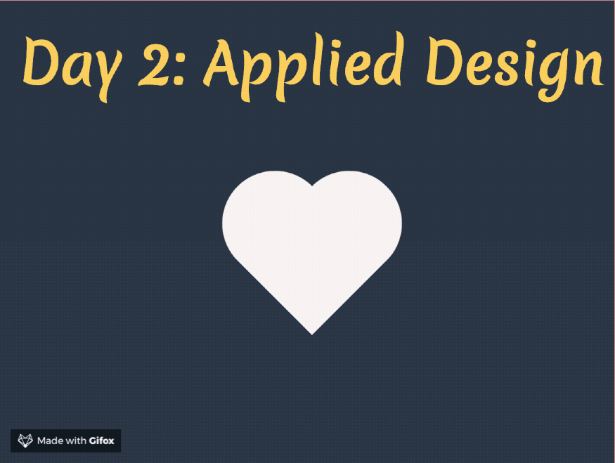

# Day 2: Applied Visual Design

Using the text-align property:

`text-align: justify | center | right | left;`

Use the line height for spacing:
```css
p {
    line-height: 25px;
}
```

## CSS Positioning

CSS treats each HTML element as its own box, thus the **CSS Box Model**. 

* Block level items automatically start on a new line (headings, paragraphs, divs)
* Inline items sit within surrounding content (images, spans)

**Relative position**: allows you to specify how css should move an element relative to its current position in the normal flow of the page. Position with the CSS offset properties of `left`, `right`, `top`, and `bottom`. Specifying how many pixels, percentages, or ems to move the item away from where it is normally positioned.

```css
.move-10px-to-the-right {
    position: relative;
    left: 10px;
}
```

**Absolute position**: locks the element in place relative to its parent container. 
> Note that this removes the element form the normal flow of the document, surrounding items ignore it.

* The CSS offset properties are also used to adjust the position.


**Fixed position**: a type of absolute positioning that locks an element relative to the browser window. Uses CSS offset properties and also removes the element from the normal flow of the document.
> Key difference is that an element with a fixed position won't move when the user scrolls.

**Float**: floating elements are removed from the normal flow of a document and pushed either to the `left` or `right` of their containing parent element. 
* Commonly used with the `width` property to specify how much horizontal space the floated element requires.

```css
.some-element { 
    float: left | right; 
    width: 50%;
}
```
**Margin**: this property is often used to center a block element horizontally.
`margin: auto;`

## Color Theory and stuff

**The color wheel**: use it for reference. Opposite angle colors are called *complementary* colors.

* cyan = (G+B)
* magenta = (R+B)
* yellow = (R+G)

**The split-complementary color scheme**

Starts with a base color, then pairs it with two colors that are adjacent to its complement. The three colors provide strong visual contrast in a desig, but a more subtle than using two complementary colors.

**HSL** introduced in CSS, this property is an alternative way to pick a color by directly stating hue, saturation, and lightness.

**Gradients**
```css
.gradient {
    background: linear-gradient(35deg, #CCFFFF, #FFCCCC);
    /* Note that you can keep adding colours */
}
```
Repeating gradients:
```css
div {
    background: repeating-linear-gradient(
        45deg,
        tomato 0px,
        tomato 30px,
        royalblue 30px,
        royalblue 90px
    );
}
```

## Transformations

#### `transform: scale(1.3);`
Scales an element

#### `transform: skewX(-30deg`;
Skews an element 

## Shapes

You can get very creative and use the `box-shadow` property to come up with ways of creating new shapes.

### ::Before & ::After
* The must have a defined `content` property. 
* They need a `width` and `height` in order to work.
* Make sure you specify their position (top,right,bottom,left) TRBL


## Animation

You declare the animation like this:
```css
@keyframe myCoolAnimation {
    0% {...}
    50% {..}
    100% {...}
}
/* You use it like this */
.animation-active {
    animation-name: myCoolAnimation;
    animation-duration: 3s;
    animation-iteration-count: infinite;
    animation-timing-function: cubic-bezier(0.25, 0.25, 0.75, 0.75);
}
```

**Nifty tricks:**
* To make an animation act as hover simply define an 100% state and set `animation-fill-mode` to `forwards`

## Demo:
